# 금융윤리와 사회책임 {.unnumbered}

***20249132 김형환***

## Standard 1 : Professionalism

### A. 법규의 이해와 준수 (Knowledge of the Law)

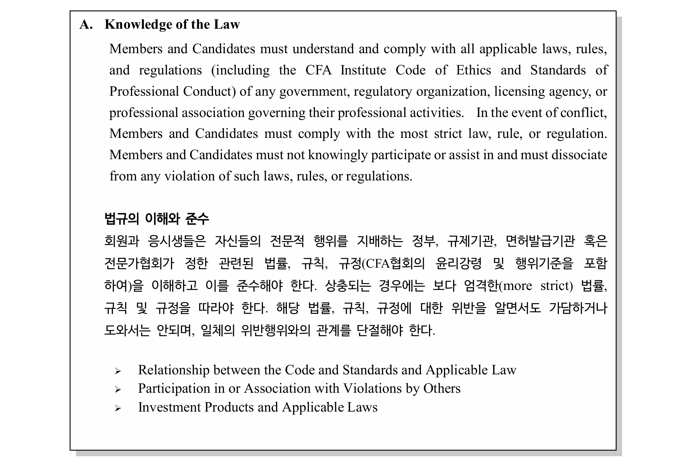

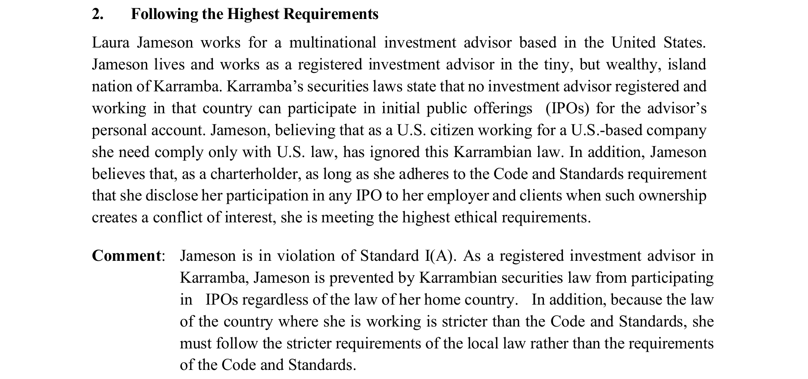

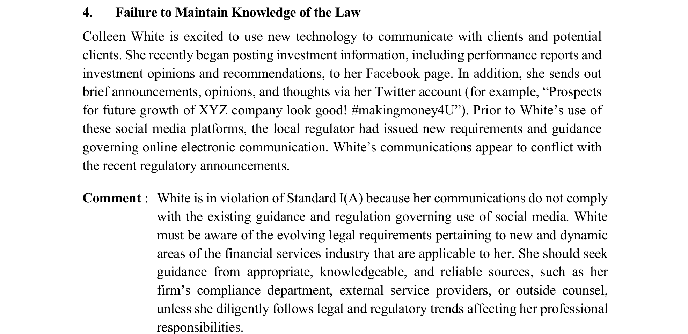

### B. 독립성과 객관성 (Independence and Objectivity)

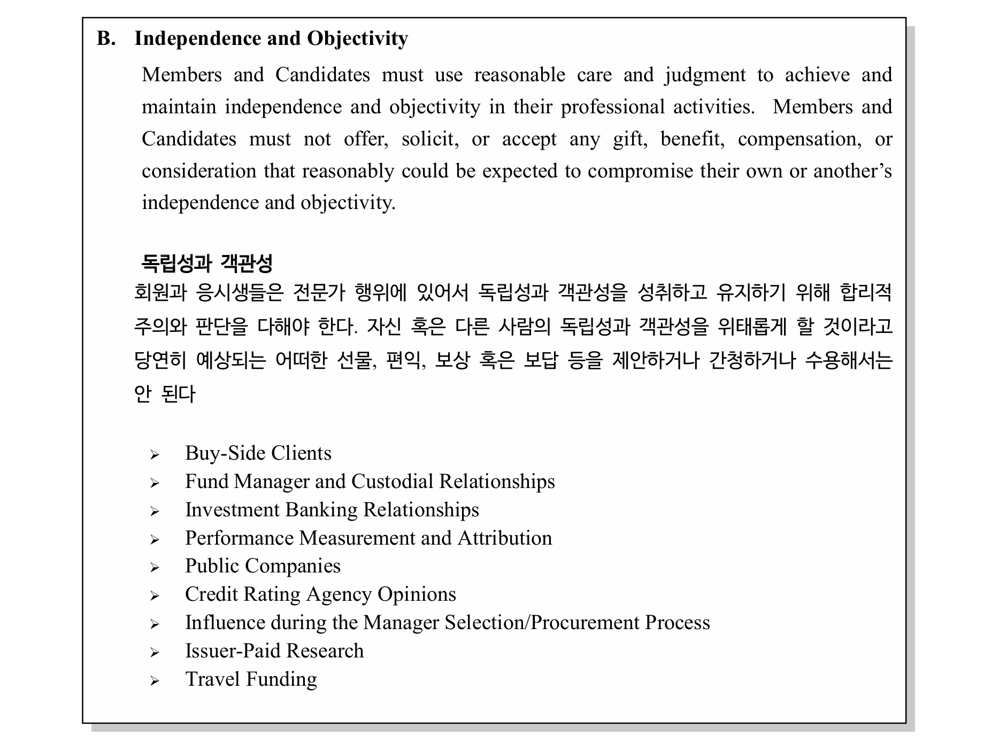

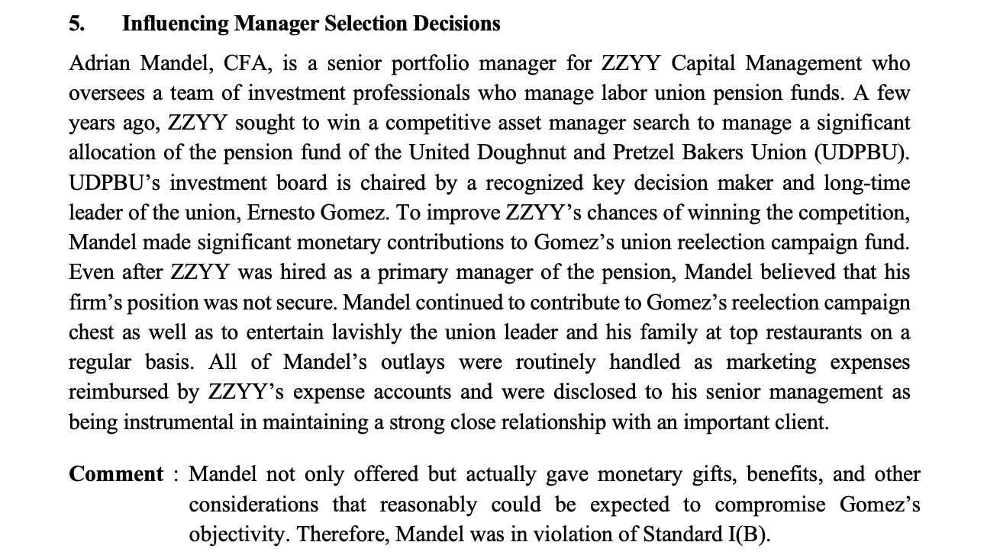

### C. 오해의 소지가 있는 표현 금지 (Misrepresentation)

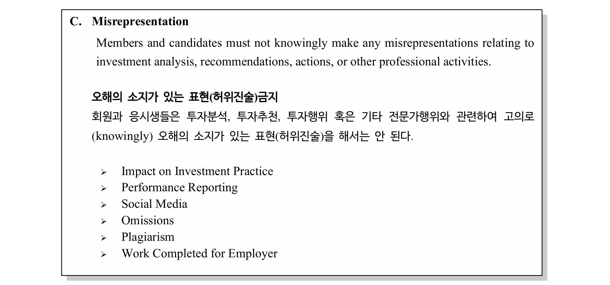

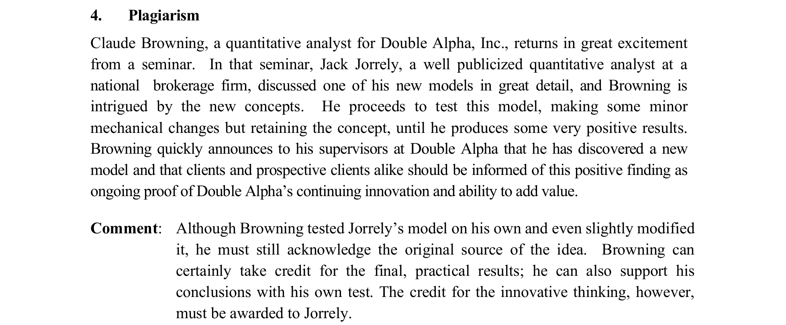

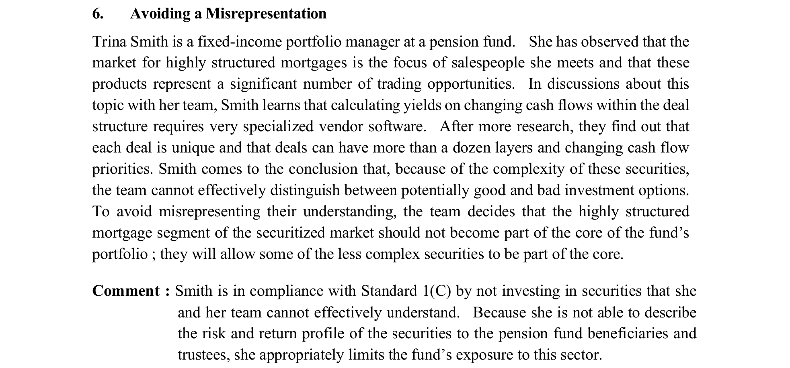

\newpage

## Standard 2 : Integrity of Capital Markets

### A. 중요한 미공개정보 (Material Nonpublic Information)

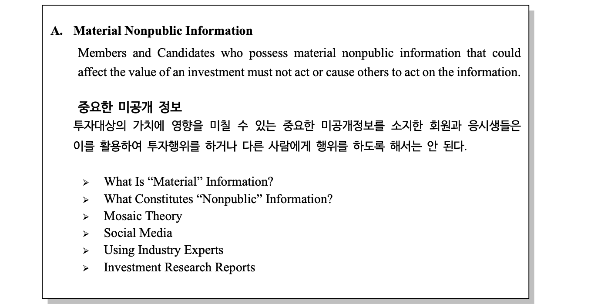

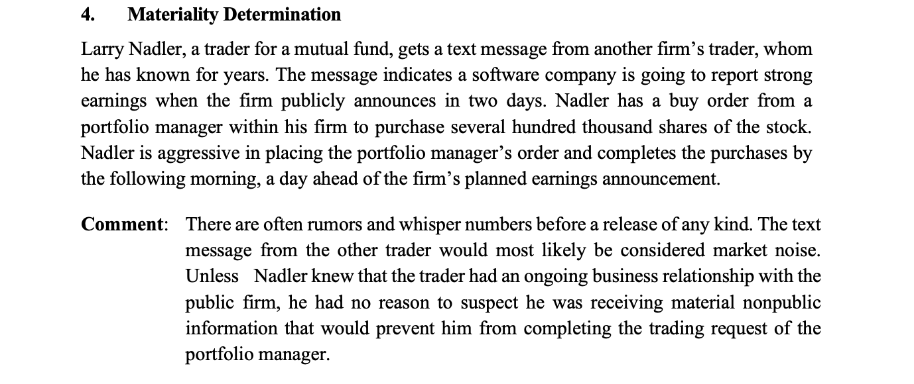

### B. 시장조작 (Market Manipulation)

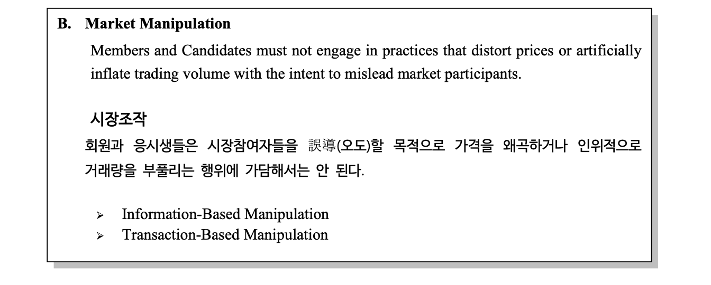

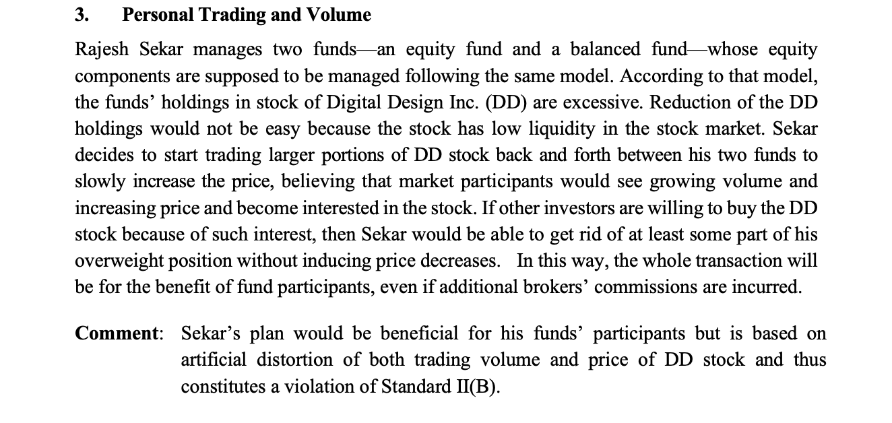

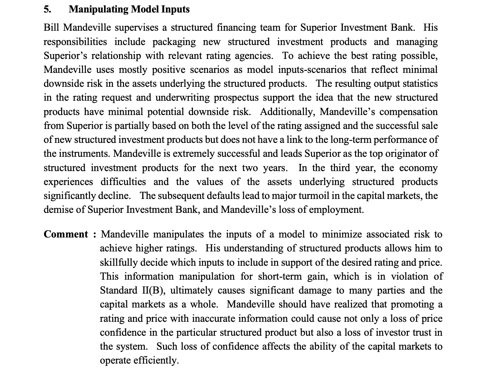

\newpage

## Standard 3 : Duties to Clients

### A. 고객에 대한 충성의무 (Loyalty, Prudence, and Care)

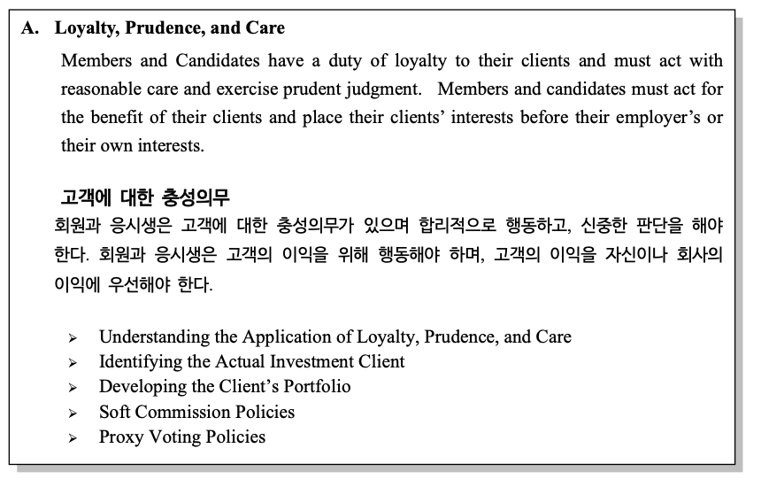

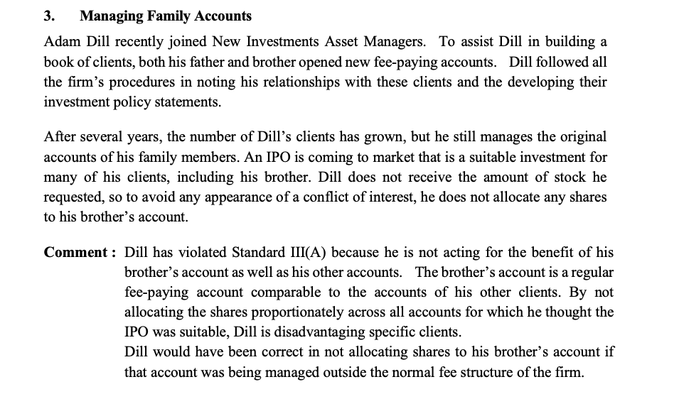

### B. 차별금지 (Fair Dealing)

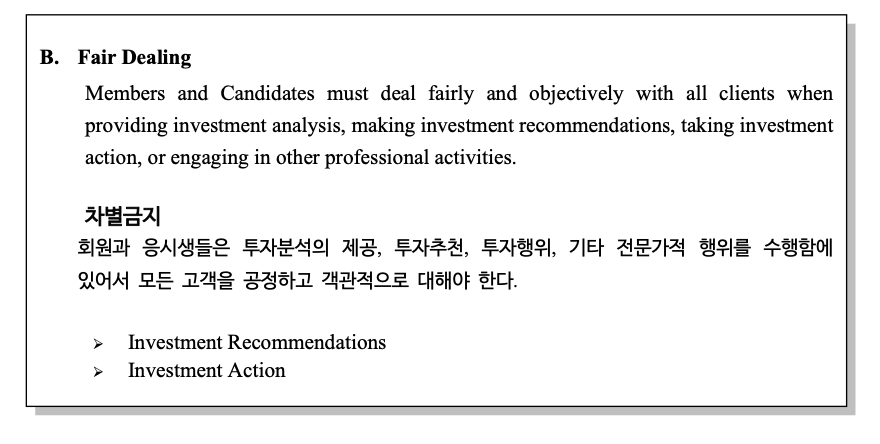

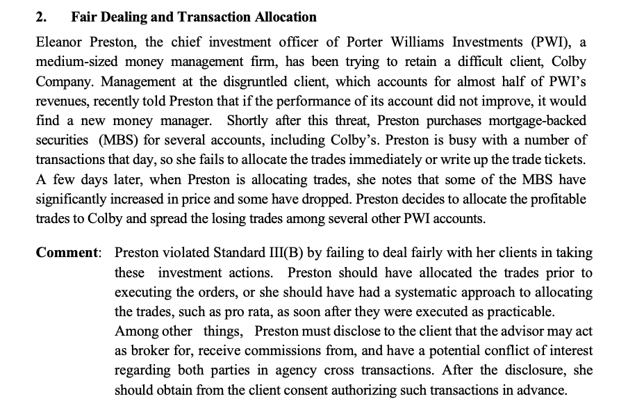

### C. 투자의 적합성 (Suitability)

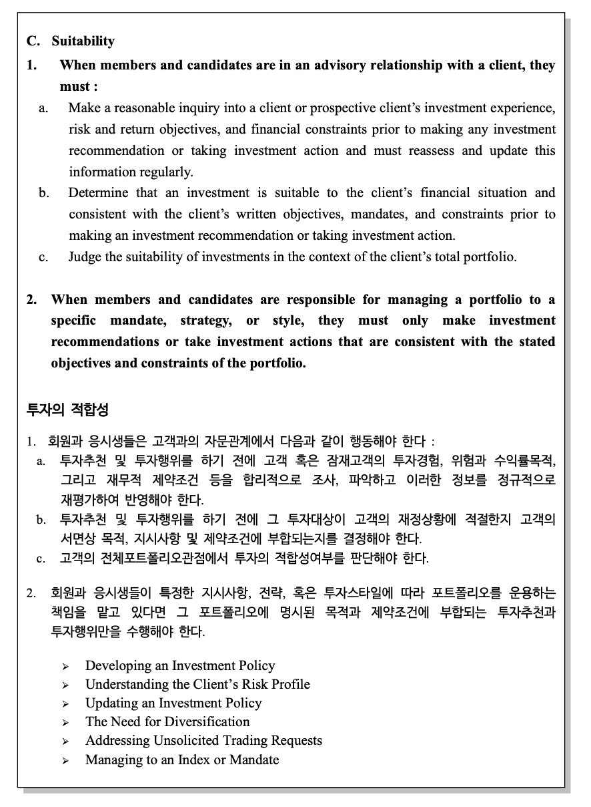

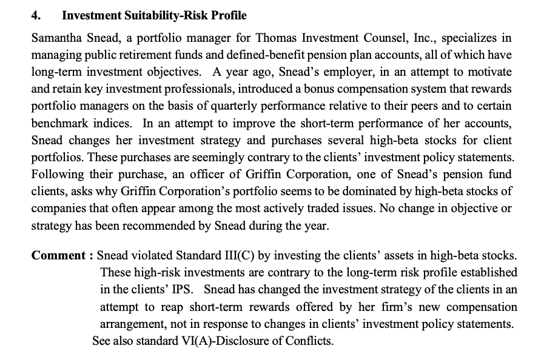

\newpage

## ***Assignment 1***

### 기준1A : 법규의 이해와 준수

- CFA는 업무를 행하는데 있어서 관련 정부기관, 규제기관, 협회 등의 다양한 법규를 준수해야함

- 법규는 법률, 규칙, 규정, 윤리강령 및 행위기준 등 업무와 연관된 **일체의 규제 또는 가이드라인**을 포괄

- 이러한 법규의 위반을 알면서도 가담하거나 도와서는 안되며, 위반행위와 연관되어서는 아니됨

- **법규간 상충이 있는 경우 상위 법규**에 따라야 함

#### **사례 2** : 법규간 상충시, 상위 법규를 따라야하나 이를 위반

    - A는 미국계 다국적 투자자문사에서 일하면서, 개인 계좌로 공모주 거래를 희망
    - A는 미국시민이고, 현재 카람바 소재의 지사에서 근무 및 거주
    - 투자자문사 직원이 공모주 거래를 하는 경우, 미국은 합법 / 카람바는 불법
    - A는 본인은 미국 시민이며, CFA 윤리강령에 따라 고객에게 공모주 거래사실을 공개하면 무관한 것으로 판단하여 공모주 거래에 참여

> 시민으로서 미국법과 임직원으로서의 카람바법, 윤리강령이 상충하는 경우로 보임. 이 경우 **임직원으로서의 카람바 증권법이 상위법규**로서 준수해야하나 이를 무시하였으므로 `A는 기준1A를 위반`

#### **사례 4** : 새로운 법규 도입 사실을 알지 못해 이를 위반

    - B는 고객 소통 및 마케팅을 위해 소셜미디어 플랫폼을 적극 활용하고자 함
    - 페이스북을 통해 성과보고서, 투자의견 및 추천정보 게재 및 트위터도 활용 예정
    - 그러나, 해당국의 규제기관은 최근 소셜미디어 사용에 대한 새로운 가이드라인 발표
    - B의 활동은 이 가이드라인과 상충되는 것으로 판단됨

> 비교적 최근에 규제가 발표되었고, **B가 이를 인지하지 못했다고 하더라도 관련 법규를 사전에 숙지**하고 준수하지 못하였으므로 `B는 기준1A를 위반`

\newpage

## ***Assignment 2***

### 기준1C : 오해 소지가 있는 표현 금지

- CFA는 투자추천 등 전문행위와 관련하여 고의로 오해 소지가 있는 표현을 해서는 안됨

#### **사례 4** : 본인이 원작자인 것처럼 표현하여 기준을 위반(표절)

    - A는 퀀트애널리스트로, 세미나에서 B가 발표한 새로운 모델에 관심을 가지고 있음
    - A는 새로운 모델을 기반으로 몇가지 수정을 거쳐서 자사에 맞는 모델로 최적화 성공
    - 최적화 모델을 본인이 개발한 것처럼 책임자에게 보고하였고, 사업화 추진 제안

> 본인이 개발한 모델인 것처럼 모호한 표현을 사용하였으므로, `A는 기준1C를 위반.` 그러나, A가 모델을 최적화한 것은 공로이므로, **원작자가 B임을 명확하게 밝혔다면 최적화된 모델을 사업화하는 것은 기준 위반이 아님**.

#### ***사례 6*** : 오해의 소지를 피하고자 매우 복잡한 구조의 상품은 투자를 포기

    - B는 연금펀드를 운용하는 채권매니저로, 최근 모기지 시장에 관심을 가지고 있음
    - 구조화 모기지 증권에 투자하고자 하며, 다양한 기회가 존재함을 긍정적으로 평가
    - 전문적인 소프트웨어로 평가해본 결과, 매우 복잡한 증권구조를 가지는 것을 확인
    - 이로 인해, 각 증권마다 팀 차원에서 적절한 투자판단을 내리기 어렵다고 판단
    - 따라서, 오해를 피하고자 덜 복잡한 모기지 증권에만 투자하는 것으로 결정

> B가 복잡한 구조화 모기지 증권에 투자하기로 하였다면, 매 증권마다 투자 판단을 내리기 위해 증권구조를 설명하고 이해하는 과정이 필요함. 이 과정에서 불필요한 오해가 발생할 수 있으므로, `B는 기준1C를 준수`하기 위해 이러한 오해를 최소화 한 것임

\newpage

## ***Assignment 3 : 1B, 2A, 2B***

### 기준 1B : 독립성과 객관성 유지

- CFA는 직무수행에 있어서 독립성과 객관성을 유지하기 위해 합리적 주의와 판단을 다해야 함

#### ***사례 5*** : 고객 접대를 통해 독립성과 객관성 훼손

    - A는 Z사의 연금기금을 운용하는 펀드매니저로, U사의 연금기금 운용사로 선정되기위해 노력중
    - U사의 업무담당자 B에게 자금 기부 등 금전적 지원과 가족을 동행한 식사 접대 등 혜택을 제공함
    - 이러한 지출은 모두 Z사의 마케팅 비용으로 처리되었으며, 커뮤니케이션 용도로 보고하였음

> 연금기금 운용사 선정 담당자인 B에게 직접적인 금전적 지원을 하는 등 업무수행에 있어서 독립성과 객관성을 훼손하였으므로 `A는 기준1B를 위반`

### 기준 2A : 미공개정보 이용 금지

- CFA는 미공개정보를 활용하여 투자행위를 하거나 다른 사람에게 하도록 해서는 안 됨

#### ***사례 4*** : 시장에 떠도는 루머를 이용하는 경우

    - A는 운용사의 거래집행 트레이더로, 다른 회사의 B로 부터 Z사의 호실적이 예상된다는 루머를 받음
    - 마침, A는 자사 포트폴리오 매니저로부터 Z사 주식의 매수 주문을 받았고, 빠르게 실행하였음

> 이러한 소문은 시장에 흔히 떠돌며, **직접적인 내부자로부터 받은 정보가 아니므로 미공개정보라고 보기 어려움**. 더군다나 A는 거래집행 트레이더로, **투자결정은 포트폴리오 매니저로부터 이루어**지고 단순히 거래집행만 하므로, `A는 기준2A를 준수`

### 기준 2B : 시장조작행위 금지

- CFA는 시장참여자를 오도할 목적으로 가격을 왜곡하거나 인위적으로 거래를 부풀리는 등 일체의 시장조작 행위를 해서는 안 됨

#### ***사례 3*** : 자전거래를 통한 거래량 왜곡

    - A는 펀드매니저로, 주식형 펀드와 혼합형 펀드를 운용하고 있으며 동일하게 D사의 주식을 보유
    - D사 주식을 두 펀드에서 모두 매도하고자 하나, 유동성이 부족하여 매도가 어려운 상황
    - 두 펀드간 교차거래를 통해 인위적으로 거래량을 부풀렸고, 그 결과 투자자 관심을 끌어 원하는 수량만큼 매도를 희망

> 이는 **자전거래를 통해 거래량을 인위적으로 부풀려 왜곡하는 시장조작**행위에 해당하므로, `A는 기준2B를 위반`

#### ***사례 5*** : 모델 파라미터 조작을 통해 성과 평가 왜곡

    - A는 투자은행의 구조화상품 설계 및 신용평가 담당자로, 그의 성과는 판매실적과 상품 신용등급에 연동
    - 손실과는 연동되어있지 않아, 모델 파라미터를 조작하여 하방위험이 거의 없는 것처럼 보이게 하였음
    - 이를 통해, 성공적인 신용등급과 판매실적을 이끌어냈으며 높은 성과급과 승진을 보상받았음
    - 그러나, 시장 상황이 악화되면서 큰 손실이 발생하였고, 자본시장에 연쇄적인 충격을 야기

> **본인의 이익을 위해 모델 파라미터를 조작**하였고, 회사와 시장 전체에 큰 손실을 미쳤으므로 중대한 위반에 해당함. `A는 기준2B를 위반`하였을 뿐만 아니라, 임직원으로서 기망, 사기행위이며 법률 위반의 소지가 있음.

\newpage

## ***Assignment 4 : 3A, 3B, 3C***

### 기준 3A : 고객에 대한 충성의무

- CFA는 고객을 응대할 때, 합리적으로 행동하고 신중한 판단을 해야 함. 고객의 이익을 위해 행동해야하며 자신이나 회사의 이익에 우선해야 함.

#### ***사례 3*** : 가족계좌라 하더라도 고객의 이익을 우선해야 함

    - A는 투자회사에 입사하였으며, 고객기반확보를 위해 가족이 투자계좌를 개설하고 A가 운용
    - 가족계좌를 포함하여 A가 관리하는 유사한 계좌에 유리한 IPO정보를 입수함
    - 그러나, 가족계좌를 우선하여 관리했다는 이해상충을 피하기 위해 모든 관리계좌에 IPO 미참여

> 가족계좌의 이해상충을 위해서라고 할지라도, **가족을 포함해서 유사한 계좌주들은 모두 고객에 해당**하므로 고객의 이익을 우선해야하는 충성의무 위반에 해당함. 즉, `A는 기준3A를 위반`하였음.

### 기준 3B : 차별금지

- CFA는 업무행위를 수행함에 있어 모든 고객을 공정하고 객관적으로 대해야 함.

#### ***사례 2*** : 특정 계좌에 이익이 나도록 분배하여 고객을 차별

    - A는 자산운용사의 투자 책임자로, 최근 우량고객 C사가 성과 부진을 이유로 이탈 우려
    - A는 성과를 위해 MBS를 과도하게 매수하였으며, 거래가 너무 많아 당일 고객계좌로 분배하지 못함.
    - 몇일 뒤, MBS에서 수익이 많이 발생하자 C사의 계좌로 모두 분배하고, 손실은 타계좌로 분배하였음.

> 기존 투자결정 당시의 분배원칙에 맞게 고객계좌로 분배해야하나, C사의 이탈을 막고자 이익을 집중시켜 고객을 차별하였으므로 `A는 기준3B를 위반`하였음.

### 기준 3C : 투자의 적합성 판단

- CFA는 고객에게 자문할 때 고객의 투자경험, 위험과 목적, 재무조건 등을 합리적으로 조사, 파악해야 함. 또한 투자대상이 고객의 재정상황에 적절한지 고객에게 부합하는지 결정해야 함. 이는 전체 포트폴리오 관점에서 이루어져야 함.

- 더불어, 포트폴리오에 명시된 목적과 제약조건에 부합하는 자문만 수행하여야 함.

#### ***사례 4*** : 고객의 투자 정책을 무시하고 투자 집행

    - A는 투자회사의 포트폴리오 매니저로, 은퇴기금이나 연금계좌 등 장기적인 자산을 관리함.
    - 회사의 성과목표를 달성하기 위해, A의 독단적인 결정으로 고베타의 주식을 편입.
    - 이는 고객의 투자 정책과 상반된 행동으로, 이러한 결정을 고객에게 보고하지 않았음.

> 장기적인 자산을 관리하는 고객의 투자 정책과 상반되었으므로, **A는 고객의 투자 적합성을 제대로 파악하고 판단하지 않았음**. 이는 `A는 기준3C를 위반`하였을 뿐만 아니라, 독단적인 결정으로 회사 평판 등에 손실을 입힐 수 있으므로 다른 문제도 야기할 수 있음.